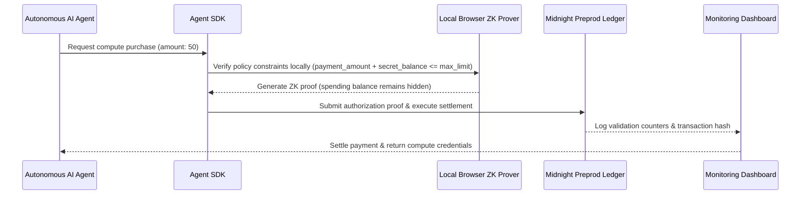

# ZkAgentPay: Agent-to-Agent Payment Protocol

ZkAgentPay is a secure payment protocol and platform enabling autonomous AI agents to transact with each other under strict policy controls, spending limits, and a zero-knowledge auditable settlement ledger.

---

## The Problem

As autonomous AI agents begin to purchase compute, API keys, training data, and hosting services on behalf of businesses, there is no safe standard for machine-to-machine payments. 
Traditional rails assume a human approver is present to review invoices and authenticate. 
Letting autonomous agents handle API keys and wallets without policy controls creates massive risks of runaway cloud spending, fraud, account drain, and zero audit accountability.

---

## The Solution

ZkAgentPay implements a decentralized policy engine and settlement gateway using Midnight's zero-knowledge contracts. 
Agents hold private spending credentials. 
When an agent initiates a transaction, it compiles a local ZK proof proving it satisfies allowlists, spending limits, and budget guidelines without exposing its secret daily spending balance or exact identifier to the counterparty or public indexers.

---

## Market Sizing (TAM/SAM/SOM)

* **Total Addressable Market (TAM)**: $9,000,000,000 emerging agentic-commerce infrastructure market.
* **Serviceable Addressable Market (SAM)**: $1,400,000,000 early adopter agent-development frameworks and SaaS integrations.
* **Serviceable Obtainable Market (SOM)**: $70,000,000 captured protocol & platform market share in 3 years.

---

## Tech Stack & Architecture

### System Flow

### Technical Blueprint
* **Frontend**: React console containing real-time spend dashboards, anomaly charts, and policy adjustment controls.
* **Backend**: Go/Rust authorization core, FastAPI microservices.
* **Zk Smart Contract**: Compact language v0.20 validating agent balance constraints.
* **Data Storage**: PostgreSQL for identities/policies, append-only logs for transaction audits, Vector database for anomaly pattern searches.

---

## Privacy Model

* **What is PUBLIC (on-chain)**: Policy execution counters, validation states, and confirmation booleans.
* **What is PRIVATE (witness)**: Secret spending balances, allowlists, and secret agent policy keys.
* **What the agent PROVES**: Proves that `balance + amount <= limit` without revealing the balance.
